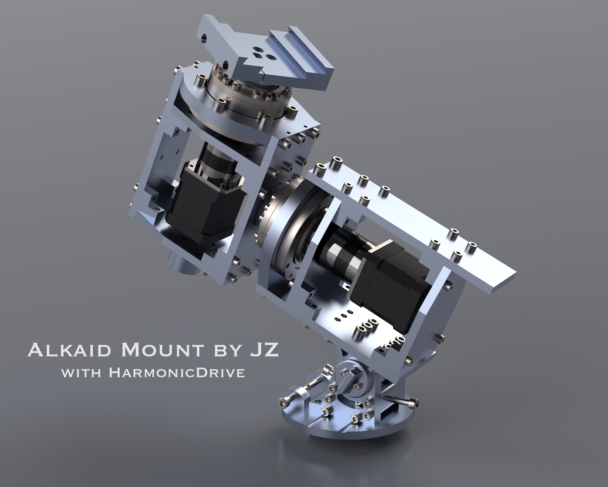

After getting trapped deeper and deeper into this hobby I finally started looking at my mount and thinking about replacing it... (Sirius EQ-G and I've only been in this hobby for 3 months!) I really appreciate the EQ-G's relatively light weight and fear that a heavier mount might destroy my enthusiasm.

As a mechanical engineer (well not really, I really work more on control/learning stuff:) what can be more fun than building one by myself? So I ordered two HDs off eBay for ~\$400 (the same model sells for ~\$1.3k new each). 

## What is HarmonicDrive and why using it?

HDs, or more accurately speaking, strain wave gearing, is a kind of gearing mechanism that generates much more torque than other common gearing (because it has much more teeth engaged at a time), while having basically zero backlash (because it utilizes deformation - kind of similar to belts which are believed to be more or less backlash-less but HDs use deformable spring metal which is better than belts even if they are filled with steel) - or, tldr: it can drive much heavier load WITHOUT the need of counterweights! 

Here is a nice GIF of how strain wave gearing works

and here is a youtube video from HarmonicDrive that tells more details

<iframe width="560" height="315" src="https://www.youtube.com/embed/nj1vO3cP7ug" title="YouTube video player" frameborder="0" allow="accelerometer; autoplay; clipboard-write; encrypted-media; gyroscope; picture-in-picture" allowfullscreen></iframe>

## Design

I have mostly finished the drawing of the metal backbone.
Most of the parts will be made with 1/4" and 3/8" 6061 aluminum alloy.
I'm trying to make the design such that I can waterjet as many parts as possible - I do have access to several really good Haas CNC machines at MIT, but I'm not sure if it's totally okay if I use them for my DIY projects (however, according to the lab manager: "technically what you make here should be for your research but what you do is none of my business" plus a wink.)
The current design is all waterjet-able except the dovetail clamp.

Hopefully I'll be free enough next week to start making some chips! (well not really, since they will mostly be waterjetted:)